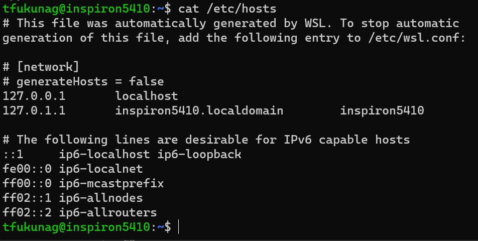

# ファイルを操作できる

## 1. ファイルの中身を出力

/etc/hosts ファイルの中身を出力してください。/etc/hosts ファイルが存在しない場合は、何らかのテキストファイルの中身を出力してください。

### コマンド実行例
`cat /etc/hosts`

### 出力結果

 


## 2. ファイルの中身をスクロール表示

/etc/hosts ファイルの中身をスクロール式で表示してください。/etc/hosts ファイルが存在しない場合は、何らかのテキストファイルの中身を表示してください。

### コマンド実行例
`less /etc/hosts`


## 3. ファイルの作成

ホームディレクトリの直下に、README.md という名前の空ファイル（中身が空のファイル）をコマンドを利用して作成してください。

### コマンド実行例
`echo >README.md`

## 4. ファイル名の変更

先程作成した README.md ファイルの名前を TMP.md という名前に変更してください。

### コマンド実行例
`mv README.md TMP.md`

## 5. ファイルのコピー

先程作成した TMP.md ファイルをコピーして COPY.md ファイルを作成してください。

### コマンド実行例
`cp TMP.md COPY.md`

## 6. ファイルの削除

先程作成した TMP.md ファイルを削除してください。

### コマンド実行例
`rm TMP.md`

## 7. シンボリックリンク

作成した README.md に対して、シンボリックリンクを貼ってください。シンボリックリンクのファイル名は README_SYMBOLIC.md としてください。作成後、README.md に対して任意の文章を追記してください。その後、symbolic_file の中身を出力し、追記した内容が README_SYMBOLIC.md にも反映されていることを確認してください。

### コマンド実行例
`ln -s README.md README_SYMBOLIC.md`

`echo "ADD" >> README.md`

`cat README_SYMBOLIC.md`


## 8. ファイルの検索

ホームディレクトリ以下のファイルに対して、README という文字列が含まれるファイルを全て検索し、出力してください。なお、find コマンドを使用して実現することができます。

### 出力例


## 9. 検索

~/sample.txt ファイルを作成し、以下の内容を記載してください。

```bash
apple
banana
grape
lemon
```

その上で、sample.txt ファイルから、"a" で始まる単語を検索してください。なお、grep コマンドを使用して実現することができます。

### 出力例


