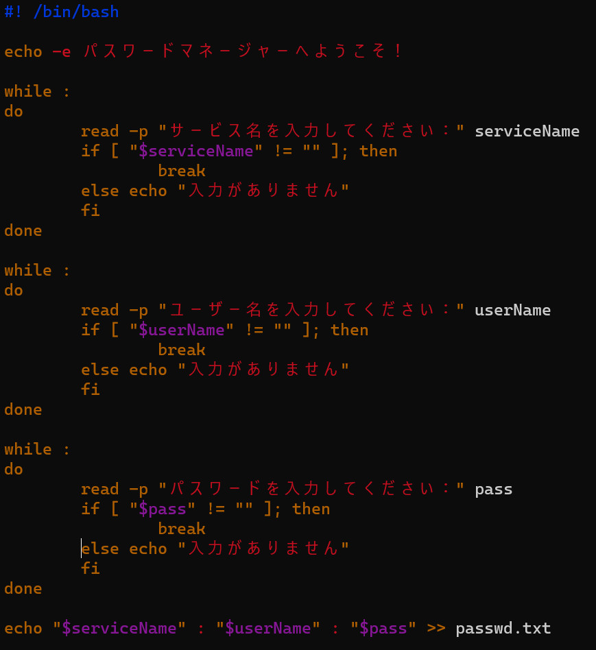

# パスワードマネージャー

パスワードを管理するパスワードマネージャーを、シェルスクリプトを利用して作成しましょう。

パスワードマネージャーとは、IDとパスワードを安全に管理するためのツールです。多くのサービスでログイン時にパスワードが必要となりますが、全てを覚えるのは困難ですし、覚えやすいパスワードを使い回すのはセキュリティ上危険です。

そこで、各サービスのIDとパスワードを保存するパスワードマネージャーを作成します。

## ステップ1

パスワードを保存する処理を、シェルスクリプトで作成します。

以下の情報を保存できるようにします。この情報はファイルに保存してください。

- サービス名
- ユーザー名
- パスワード

シェルスクリプトを実行すると、以下が表示されます。

```bash
パスワードマネージャーへようこそ！
サービス名を入力してください：
ユーザー名を入力してください：
パスワードを入力してください：
# 入力が完了したら
Thank you!
```

サービス名、ユーザー名、パスワードの入力が求められ、入力された情報を "サービス名:ユーザー名:パスワード" という形式でファイルに保存します。シェルスクリプトを実行するたびに入力された情報はファイルに追記されるようにしてください。

### シェルスクリプト例



## ステップ2

パスワードを保存し、出力するパスワードマネージャーをシェルスクリプトで作成します。パスワードの暗号化はしません。

以下の情報を保存・出力できるようにします。この情報はファイルに保存してください。

- サービス名
- ユーザー名
- パスワード

シェルスクリプトを実行すると、以下のメニューが表示されます。

```bash
パスワードマネージャーへようこそ！
次の選択肢から入力してください(Add Password/Get Password/Exit)：
```

Add Password が入力されると、サービス名、ユーザー名、パスワードの入力が求められ、入力された情報をファイルに保存します。
Get Password が入力されると、サービス名の入力が求められ、入力されたサービスのサービス名、ユーザー名、パスワードが表示されます。
Exit が入力されると、プログラムが終了します。
Exit が入力されるまではプログラムは終了せず、「次の選択肢から入力してください(Add Password/Get Password/Exit)：」が繰り返されます。

▼呼び出し

```bash
./password_manager.sh
```

▼アウトプット

```bash
パスワードマネージャーへようこそ！
次の選択肢から入力してください(Add Password/Get Password/Exit)：

# Add Password が入力された場合
サービス名を入力してください：
ユーザー名を入力してください：
パスワードを入力してください：

パスワードの追加は成功しました。
次の選択肢から入力してください(Add Password/Get Password/Exit)：

# Get Password が入力された場合
サービス名を入力してください：
## サービス名が保存されていなかった場合
そのサービスは登録されていません。
## サービス名が保存されていた場合
サービス名：hoge
ユーザー名：fuga
パスワード：piyo

次の選択肢から入力してください(Add Password/Get Password/Exit)：

# Exit が入力された場合
Thank you!
## プログラムが終了

# Add Password/Get Password/Exit 以外が入力された場合
入力が間違えています。Add Password/Get Password/Exit から入力してください。
```
### シェルスクリプト例


## ステップ3(任意)

パスワードが保存されたファイルを暗号化しましょう。ファイルが暗号化されていないとパスワードがファイルから直接確認可能なためセキュリティ上危険性が高いです。

暗号化には好きなツールを使っていただいて構いません。なお、有名なものには GnuPG(GNU Privacy Guard) があります。

具体的には、以下の仕様を追加します。

- Add Password が入力された場合、サービス名、ユーザー名、パスワードをファイルに保存した後にファイルを暗号化します
- 暗号化されたファイルを開いて、パスワードが読み取れないことを確認してください
- Get Password が入力された場合、暗号化されたファイルを復号化して（元の状態に戻して）サービス名、ユーザー名、パスワードを表示します。なおその際に、ファイルそのものは暗号化された状態を維持してください（Get Password後にファイルを開いてもファイルは暗号化されています）
