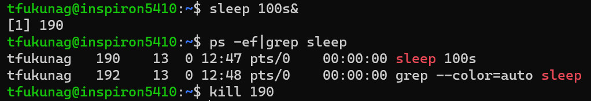

# プロセス・ジョブを管理できる

## 1. プロセス

全ユーザーのプロセスを表示してください。

### コマンド例
`ps -ef`

## 2. バックグラウンド

sleep コマンドを利用して処理を100秒停止する処理を、バックグラウンドで実行してください。

### コマンド例
`sleep 100s&`

## 3. プロセス・ジョブの終了

2でバックグラウンドで実行されている sleep コマンドを終了させてください。

### コマンド例
`ps -ef|grep sleep` 

プロセスIDを確認した後

`kill` プロセスID

### コマンド実行例

